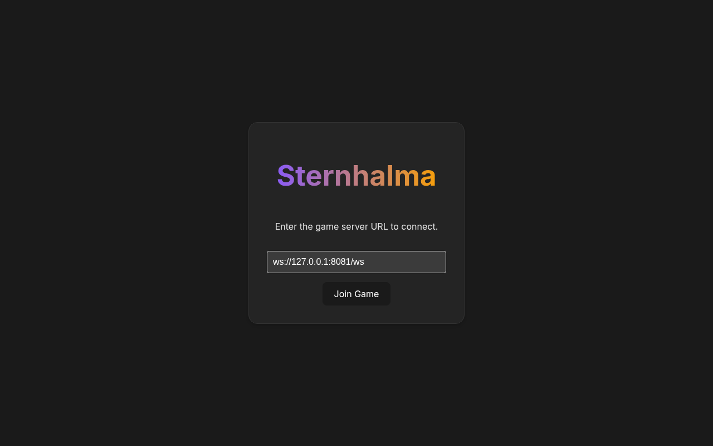
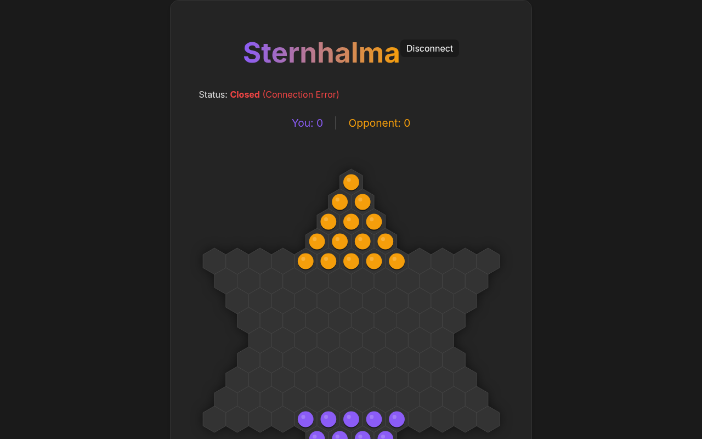

# Sternhalma Web Client

A modern, responsive web client for the Sternhalma (Chinese Checkers) game, built with **React**, **TypeScript**, and **Vite**.

This project serves as the frontend interface for the [Sternhalma Server](https://github.com/eliseuv/sternhalma-server).

## Screenshots

<p align="center">
  
  &nbsp;
  
</p>

## Features

- **Real-time Gameplay**: Connects to the Sternhalma server via WebSocket for instant move updates.
- **Interactive Board**: SVG-based hexagonal board with "marble-in-hole" design.
- **Visual Feedback**:
  - Highlights available moves and targets.
  - Shows last move with clear indicators.
  - Piece selection and candidates.
- **Dark Mode**: Sleek, modern dark theme.
- **Server Selection**: Allows manually specifying the game server URL.
- **Robust Networking**: Automatic reconnection and state synchronization using `react-use-websocket` and `cbor-x`.

## Prerequisites

- **Node.js** (v18 or higher recommended)
- **Sternhalma Server**: You need a running instance of the backend server.
  - Repository: [https://github.com/eliseuv/sternhalma-server](https://github.com/eliseuv/sternhalma-server)
  - Follow the instructions in the server repository to build and run it.
  - Default WebSocket address: `ws://127.0.0.1:8081/ws`

## Setup

1. **Install dependencies**:

   ```bash
   npm install
   ```

2. **Connect to Server**:

   Ensure your local or remote Sternhalma server is running.

   When the client application starts, you will see a Welcome Screen. Enter your server URL (default: `ws://127.0.0.1:8081/ws`) and click "Join Game".

## Running the Client

### Development Mode

Run the development server with Hot Module Replacement (HMR):

```bash
npm run dev
```

Open your browser at the URL shown (usually `http://localhost:5173`).

### Production Build

To build the application for production:

```bash
npm run build
```

The output will be in the `dist/` directory. You can serve it using any static file server, for example `serve`:

```bash
npx serve -s dist
```

## Architecture

- **`src/App.tsx`**: Main container. Manages view switching between Welcome Screen and Game.
- **`src/WelcomeScreen.tsx`**: Entry screen for inputting the server URL.
- **`src/Game.tsx`**: Main game logic component. Manages WebSocket connection, game state, and renders the Board.
- **`src/Board.tsx`**: Renders the game board. Handles:
  - Coordinate conversion (Axial Hex <-> Pixel)
  - SVG rendering of holes, marbles, and highlights
  - Click handling for selecting pieces and targets
- **`src/protocol.ts`**: TypeScript definitions for the communication protocol (RemoteInMessage, RemoteOutMessage, etc.).
- **`src/constants.ts`**: Game constants (Valid positions, starting setups).

## Tech Stack

- **Framework**: React 18
- **Build Tool**: Vite
- **Language**: TypeScript
- **Styling**: Vanilla CSS (Variables, Flexbox)
- **Protocols**: WebSocket (via `react-use-websocket`), CBOR (via `cbor-x`)

## License

This project is licensed under the MIT License.
